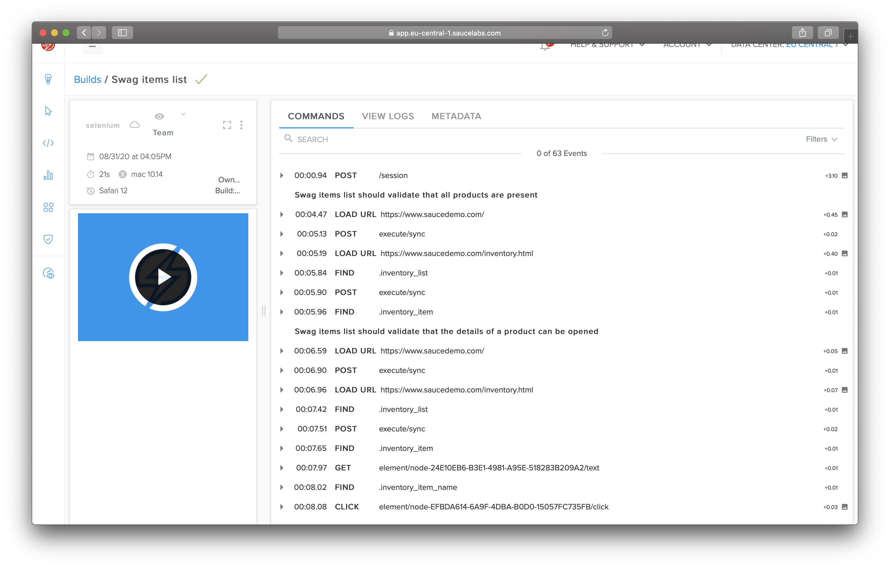
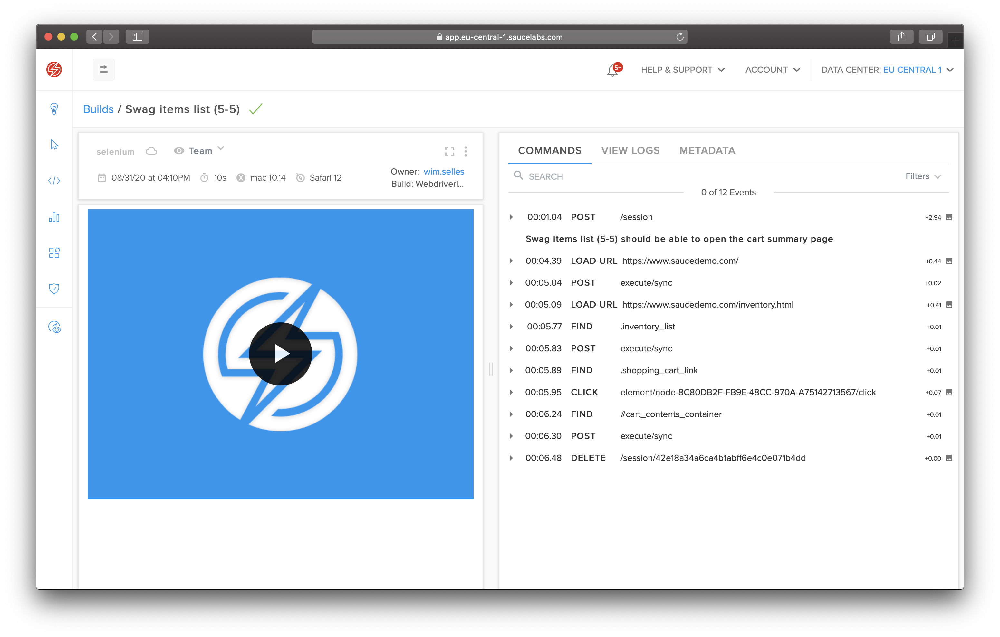
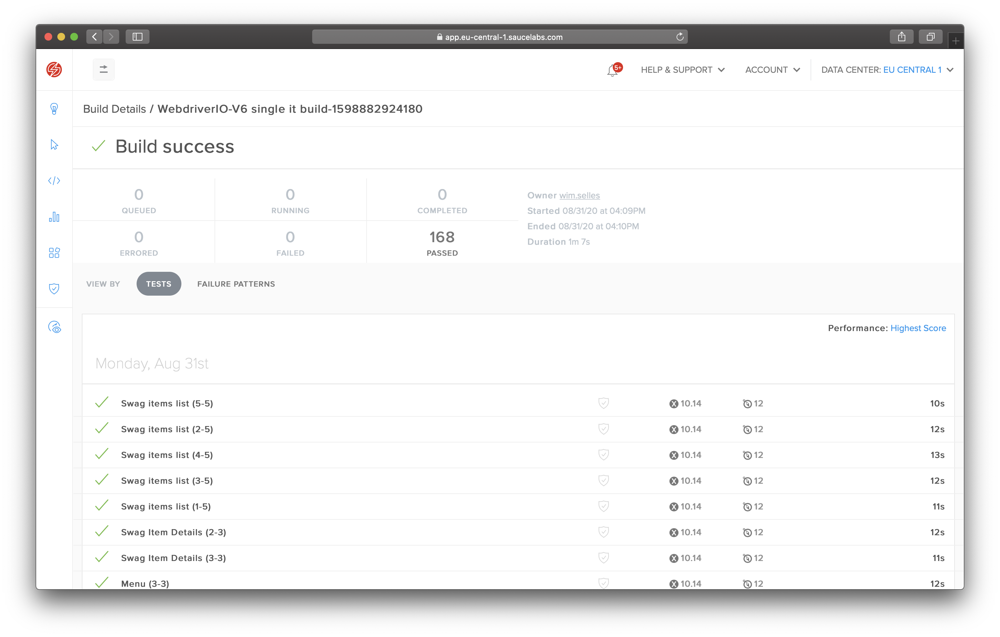
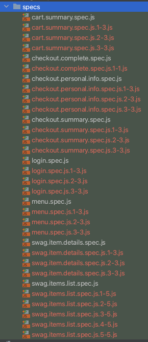

WebdriverIO Parallel Runner
===========================

[](https://travis-ci.com/wswebcreation/wdio-parallel-runner-service)
[](https://david-dm.org/wswebcreation/wdio-parallel-runner-service)
[](https://codecov.io/gh/wswebcreation/wdio-parallel-runner-service)

> WebdriverIO Parallel Runner Service provides you the option to run each test in a test-file as a single test for optimizing parallelization.
> - This can only be used with Jasmine and Mocha see [TODO](#todo)
> - **You can only run tests in parallel if each test is autonomous and has its own state**
> - Needs to follow a certain structure to work, see [What is supported](#what-is-supported)
> - Currently **DOES NOT** support **MULTIPLE** or **NESTED** describes
>
> This module is still in beta and any feedback would be appreciated.

## Why this module
By default WebdriverIO, together with Mocha, Jasmine or Cucumber, can only run tests in parallel based on a test-file,
not based on a single test within a test-file. When you are running your tests in for example a cloud service like Sauce Labs,
you can get a lot of WebDriver commands making it harder to debug. In the below image you see 63 WebDriver commands
(which is not a lot, but we've seen much more). When the test fails it is hard to determine which command or which test made the
build fail.



Secondly you are not optimally using your concurrency, especially if you have for example 100 concurrent sessions which you can use.
In this case you are only using a max of 56.


When you use this module you can easily debug your tests, take for example the output of the spliced testcase from above.



And you are using your concurrency to the max



## Installation
The easiest way is to keep `wdio-parallel-runner-service` as a devDependency in your `package.json`.

```json
{
    "devDependencies": {
        "wdio-parallel-runner-service": "^0.1.0"
    }
}
```

You can simple do it by:

```bash
npm install wdio-parallel-runner-service --save-dev
```

Instructions on how to install `WebdriverIO` can be found [here.](https://webdriver.io/docs/gettingstarted.html)

## Configuration

The following code shows the default wdio test runner configuration. Just add `'parallel-runner'` as a service
to the array.

```js
// wdio.conf.js
module.exports = {
  // ...
  services: ['parallel-runner'],
  // ...
};
```

## What is supported
> **NOTE:** Each tests in a test-file needs to be autonomous, meaning it needs to have its own state. If you've written your tests
> in such a way that testcase 2 relies on the outcome of test 1 then this module will not work for you.

This module will do the following:
- read all test files before starting all workers
- determine for each test files if it has the proper structure (see below)
- determine the amount of tests in the test file and make a copy of the file for each test
- after the file is copied it will only keep 1 (unique) test in each file and preserves all hooks (`before|beforeEach|beforeAll|after|afterEach|afterAll`)
- start a worker for each test file and start running

Tests need to have a structure like this.

```js
const Foo = require('foo');

describe('Foo', () => { // `fdescribe` or `xdecribe` are also supported
    before(() => { // optional
        // Do something
    });

    after(() => { // optional
        // Do something
    });

    beforeEach(() => { // optional
        // Do something
    });

    afterEach(() => { // optional
        // Do something
    });

    beforeAll(() => { // optional
        // Do something
    });

    afterAll(() => { // optional
        // Do something
    });

    it('should be able foo the bar', () => {
        // Do something
    });

    fit('should be able to bar', () => {
        // Do something
    });

    xit('should be able to bar', () => {
        // Do something
    });
});
```

Meaning **ONE** `describe|fdescribe|xdescribe`. If multiple describes are detected the file will be not be split and run in its original state.

The above code will be split into **THREE** files, independent of `it|fit|xit` and will look like this:

```js
// File one
const Foo = require('foo');

describe('Foo (1-3)', () => {
    // all hooks will be copied
    before(() => {});
    after(() => {});
    beforeEach(() => {});
    afterEach(() => {});
    beforeAll(() => {});
    afterAll(() => {});

    it('should be able foo the bar', () => {
        // Do something
    });
});

// File two
const Foo = require('foo');

describe('Foo (2-3)', () => {
    // all hooks will be copied
    before(() => {});
    after(() => {});
    beforeEach(() => {});
    afterEach(() => {});
    beforeAll(() => {});
    afterAll(() => {});

    fit('should be able to bar', () => {
        // Do something
    });
});

// File three:
const Foo = require('foo');

describe('Foo (3-3)', () => {
    // all hooks will be copied
    before(() => {});
    after(() => {});
    beforeEach(() => {});
    afterEach(() => {});
    beforeAll(() => {});
    afterAll(() => {});

    xit('should be able to bar', () => {
        // Do something
    });
});
```

## Temporary files
As you might have read in [What is supported](#what-is-supported) the test-file is being sliced into multiple files with single tests in them.
To make this work this module will:

- create temporary copies of the original file next to the original file, but with post-fix `{current-of}.js` which will result in:
    `original.spec.js.1-2.js`\
    `original.spec.js.2-2.js`\
    
- Alter the initial describe name with a post-fix ` (current-of)` resulting in
    `describe('foo (1-2)', ()=>{});`\
    `describe('foo (2-2)', ()=>{});`

The temporary files will be removed when the tests have been executed.

> NOTE: If WebdriverIO breaks somewhere before the test have been finished you might have a bunch of extra files in your folder
> next to your original folder. There is currently no solution for this.

## What is not supported (yet)!
### TypeScript
This module currently doesn't support TypeScript

### Conditional its
There are situations where you can have a test like this.

```js
describe('Foo', () => {
    it('should be able foo the bar', () => {
        // Do something
    });

    // Don't execute this test because of something
    if(browser.region === 'foo') {
        it('should be able to only test this when the region is foo', () => {
            // Do something
        });
    }

    it('should be able to bar', () => {
        // Do something
    });
});
```

Because this module can't detect the current conditional structure properly now it will be split into **TWO** testfiles instead of **THREE**
due to the `if`-statement. The output will look like this

```js
// First file
describe('Foo (1-2)', () => {
    it('should be able foo the bar', () => {
        // Do something
    });

    // Don't execute this test because of something
    if(browser.region === 'foo') {
        it('should be able to only test this when the region is foo', () => {
            // Do something
        });
    }
});

// Second file
describe('Foo (2-2)', () => {
    // Don't execute this test because of something
    if(browser.region === 'foo') {
        it('should be able to only test this when the region is foo', () => {
            // Do something
        });
    }

    it('should be able to bar', () => {
        // Do something
    });
});
```

### Clean up temporary files
If WebdriverIO breaks somewhere before the test have been finished you might have a bunch of extra files in your folder
next to your original folder. There is currently no solution for this.

## Contributing
You like this module and want to help making it better? Awesome! Have a look into our [Contributor Guide](./docs/CONTRIBUTING.md) to get started with setting up the repo.

## TODO
- [ ] Add support to split TypeScript files, see [TypeScript](#typescript)
- [ ] Add support to run Cucumber tests in parallel by splitting them up
- [ ] Add support for multiple and or nested `describes`
- [ ] Add support for conditional `it`s, see [Conditional its](#conditional-its)
- [ ] Think of a better way to store the temporary files.
This is currently difficult because we don't know the proper reference to the imports/page-objects and so on

## Thanks
A special thanks to:
- [Nikolay Advolodkin](https://github.com/nadvolod) for always pushing the limits :wink:  and starting [this thread](https://github.com/webdriverio/webdriverio/issues/3962)
- [Sean Poulter](https://github.com/seanpoulter) for showing an initial AST solution
- [Christian Bromann](https://github.com/christian-bromann) for helping me out with all my WebdriverIO questions
